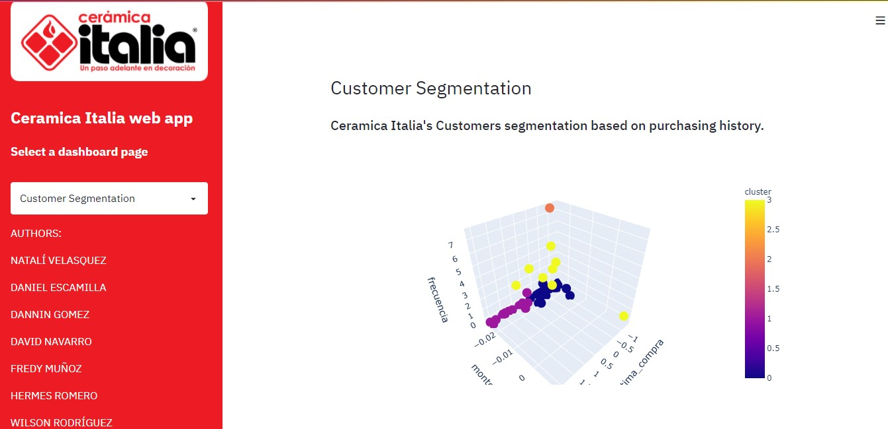
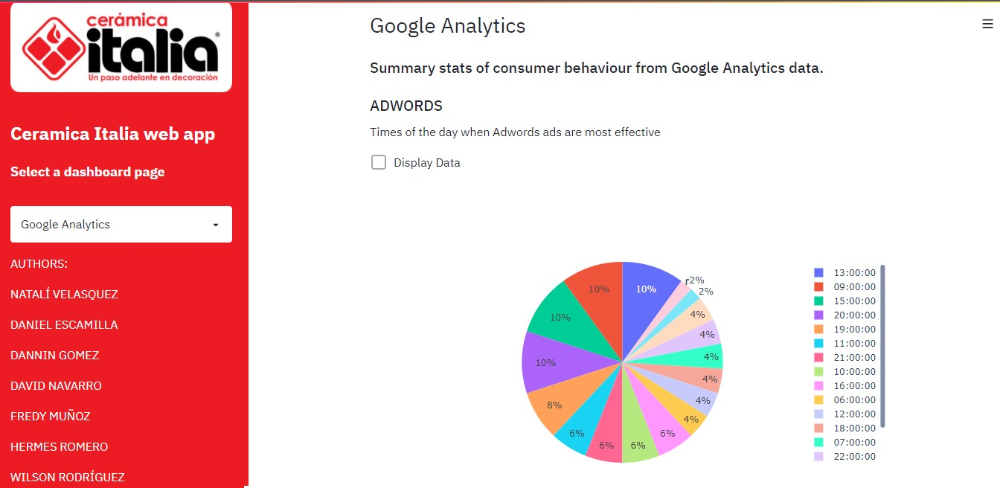
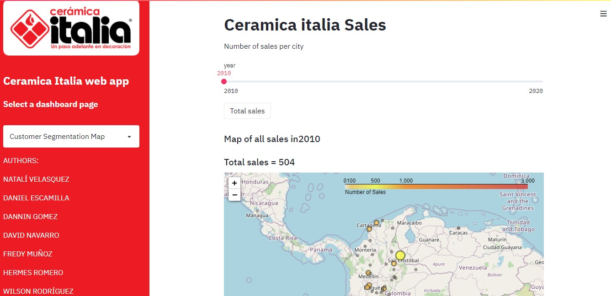

# Project_DS4A
Code and data about the final project required for the DS4A-3.0 program in Colombia.   
 
**To visit the web app running on an EC2 instance** ---> http://3.138.114.246:8501/  
 
**To run the app locally just follow these steps:**  
1. Create & activate a new virtual environment.
2. install the required libraries: <code>pip install -r reqirements.txt</code>
3. cd to the app directory & run the streamlit web app: <code>streamlit run main_app.py</code>

## App 1 - Customer Segmentation

## App 2 - Google Analytics

## App 3 - Sales Map

